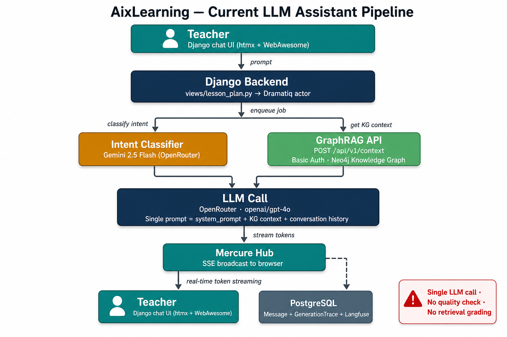
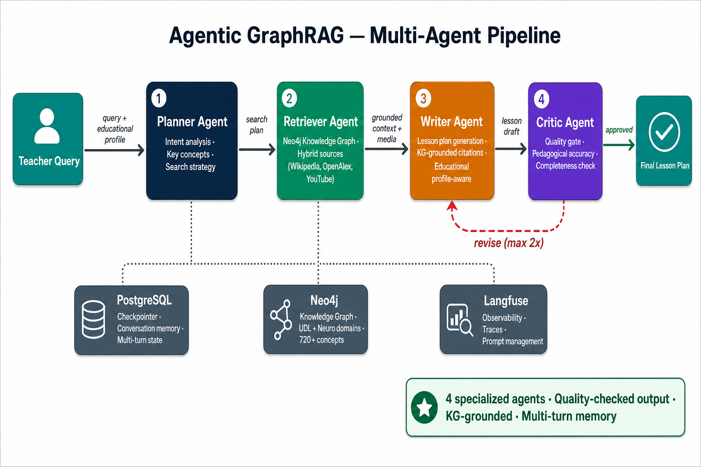
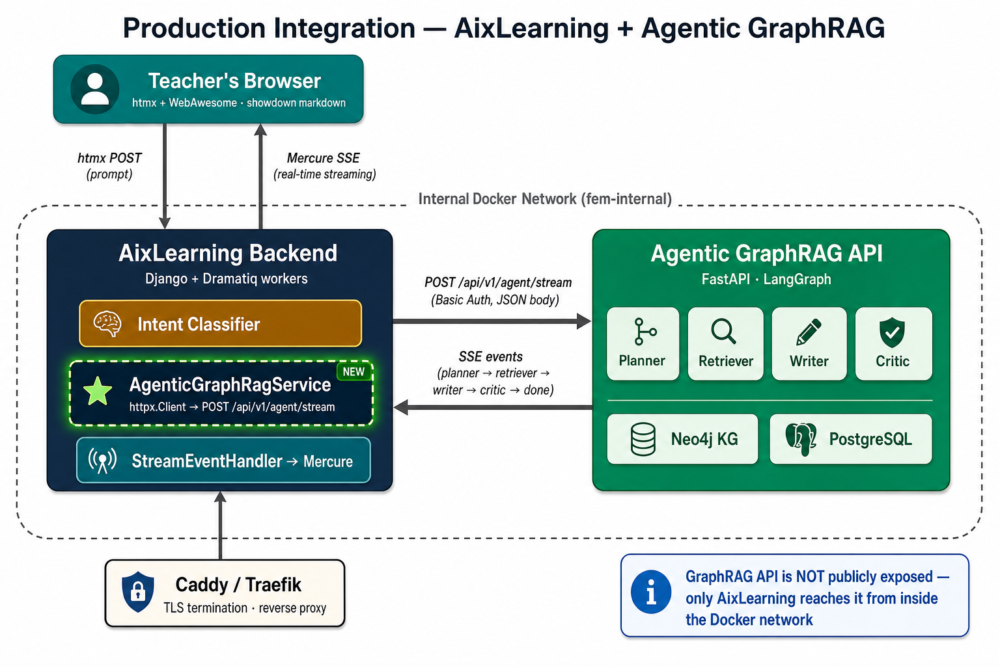

# Agentic GraphRAG — Integration Strategy for AixLearning

**Date:** May 13, 2026
**From:** AI Team (LM)
**To:** FEM Direction, Stakeholders, and AixLearning DEV Team
**Subject:** Integrating the Agentic GraphRAG system into the AixLearning production platform

---

## A. Executive Summary

AixLearning currently serves teachers through a suite of 22 AI-powered tools — lesson planners, homework generators, feedback assistants, and more — all backed by a single-pass architecture: one LLM call per teacher interaction, optionally enriched with a one-shot retrieval from our Knowledge Graph.

This architecture has served AixLearning well. However, the educational AI landscape has matured rapidly. Research from Microsoft Research, Google DeepMind, Anthropic, and the broader LangChain ecosystem now demonstrates that **multi-agent architectures with retrieval-augmented generation (RAG)** produce significantly higher-quality, more reliable, and more pedagogically grounded outputs than single-pass LLM calls.

We have built an **Agentic GraphRAG system** — a multi-agent pipeline specifically designed for educational content generation. It uses four specialized AI agents (Planner, Retriever, Writer, Critic) orchestrated by LangGraph, grounded in a Neo4j Knowledge Graph containing 720+ neuroscience and pedagogical concepts across two domains (UDL — Universal Design for Learning, and Neuroscience-based methodologies).

**The proposal:** integrate the Agentic GraphRAG as the AI backend for the UDL and NEURO tool types within AixLearning, replacing the current single-pass pipeline for these two domains only. The other 20 tool types continue unchanged on the existing OpenAI pipeline. The integration is API-to-API: AixLearning calls our FastAPI service, receives structured events, and renders the result through its existing chat UI. **No database sharing, no codebase merging, no disruption to the 20 other tools.**

**Key numbers:**

| Metric | Current (single-pass) | Agentic GraphRAG |
|---|---|---|
| AI agents per interaction | 1 (single LLM call) | 4 (Planner → Retriever → Writer → Critic) |
| Knowledge Graph grounding | One-shot context injection | Deep multi-query retrieval + hybrid sources |
| Quality assurance | None | Critic agent with pedagogical accuracy scoring |
| Revision capability | None | Up to 2 automatic revisions based on Critic feedback |
| Multi-turn memory | Conversation history only | Checkpointed state with summary windowing |
| Observability | Langfuse trace per call | Per-agent traces with full pipeline telemetry |
| Domains covered | All 22 tool types (generic) | UDL + NEURO (specialized, KG-grounded) |

**Estimated integration effort:**
- **AI team (us):** ~3 working days (deploy, auth, CORS, guardrails)
- **DEV team (FEM):** ~1.5 working days (new service wrapper, routing update, Docker wiring)
- **Earliest production cutover:** end of Week 3 from kickoff

---

## B. Architecture

This section presents three views of the architecture: how AixLearning works today, how the Agentic GraphRAG pipeline works internally, and how the two systems communicate in production.

### B.1 AixLearning — Current LLM Assistant Pipeline

The current AixLearning pipeline follows a well-established pattern for AI-assisted applications. When a teacher submits a prompt through the Django chat interface, the system:

1. **Classifies the intent** using a lightweight model (Gemini 2.5 Flash via OpenRouter) to determine whether the teacher wants text generation, quiz generation, or image generation.

2. **Retrieves Knowledge Graph context** (for eligible tool types) by calling our GraphRAG API at `POST /api/v1/context`. This returns a structured package: a domain-specific system prompt, a response template, and the formatted Knowledge Graph context relevant to the query.

3. **Makes a single LLM call** to OpenRouter (`openai/gpt-4o`) with the assembled prompt — combining the system prompt, KG context, conversation history, and the teacher's current message.

4. **Streams tokens in real time** to the teacher's browser via Mercure (Server-Sent Events), with the final response persisted as a `Message` record and traced through Langfuse.

This architecture is simple, fast (~90 seconds per response), and reliable. Its limitation is structural: there is no verification of the output quality, no mechanism to detect when the Knowledge Graph has insufficient coverage for a topic, and no ability to revise the response before presenting it to the teacher. The LLM generates one answer, and that answer is final.

### B.2 Agentic GraphRAG — Multi-Agent Pipeline

The Agentic GraphRAG pipeline replaces the single LLM call with four specialized agents, each responsible for one phase of the lesson-plan generation:

1. **Planner Agent** — Analyzes the teacher's request to extract intent, key pedagogical concepts, and a search strategy. The Planner considers the educational profile (class composition, disabilities, classroom environment, available time) to formulate targeted queries for the Knowledge Graph.

2. **Retriever Agent** — Executes the Planner's search strategy against the Neo4j Knowledge Graph (720+ concepts, 745+ relationships across UDL and Neuro domains). When a topic falls outside the KG's coverage, the Retriever supplements with hybrid sources: Wikipedia, OpenAlex (academic papers), and curated YouTube content.

3. **Writer Agent** — Generates the lesson plan using the retrieved context, the educational profile, and KG-grounded citations. The Writer produces structured Markdown with explicit pedagogical methodology references, adapted to the specific needs of the teacher's classroom.

4. **Critic Agent** — Evaluates the Writer's output against pedagogical accuracy, completeness, and alignment with the educational profile. If the Critic identifies deficiencies, it sends the draft back to the Writer with specific feedback for revision (up to 2 iterations).

The pipeline is orchestrated by **LangGraph** (a state-machine framework for multi-agent systems) and backed by **PostgreSQL** for multi-turn conversation memory. Each agent run generates detailed **Langfuse traces** for production observability.

### B.3 Production Integration — How They Communicate

The production deployment places both services inside a shared internal Docker network. The key design decision is that **the Agentic GraphRAG API is never publicly exposed** — only the AixLearning backend can reach it from inside the Docker network. This dramatically simplifies the security surface.

The communication flow is:

1. **Teacher submits a prompt** through the existing Django chat UI (htmx POST).
2. **AixLearning's Dramatiq worker** detects that the `plan_type` is UDL or NEURO and routes the request to a new `AgenticGraphRagService` (a sibling of the existing `GraphRagService` that already calls `/api/v1/context`).
3. **The new service calls** `POST /api/v1/agent/stream` on our FastAPI server using the same Basic Auth credentials already configured for the legacy endpoint.
4. **Our agent pipeline runs** (Planner → Retriever → Writer → Critic) and emits SSE events as each phase completes.
5. **The AixLearning wrapper translates** our SSE events into the existing `LLMTextDeltaEvent` shape that the `StreamEventHandler` already knows how to process.
6. **Mercure broadcasts** the streamed content to the teacher's browser — the same path as today. The teacher's chat UI does not know whether the response came from OpenRouter directly or via our agent.
7. **Observability is unified** — the trace ID from our agent flows into AixLearning's `GenerationTrace` model, the same Langfuse integration already in production.

For the other 20 tool types, the flow is byte-identical to today. The routing decision is a single conditional check on `plan_type`.

---

## C. LLM Assistant vs Agentic GraphRAG — An Evidence-Based Comparison

### C.1 The industry shift from single-pass to multi-agent architectures

The AI engineering community has undergone a significant architectural transition since 2024. Several landmark publications and production deployments have established multi-agent systems as the preferred pattern for high-stakes content generation:

- **Microsoft Research's GraphRAG paper (2024)** demonstrated that graph-based retrieval combined with LLM-generated community summaries produces substantially more comprehensive and diverse answers than naive vector-similarity RAG for global sensemaking queries — complex questions requiring synthesis across multiple topics, precisely the case for educational lesson planning. (Edge et al., 2024, arXiv:2404.16130)

- **Anthropic's "Building Effective Agents" guide (2024)** formalized the evaluator-optimizer workflow pattern — where one LLM generates a response while another evaluates and provides feedback in a loop — as a key architecture for tasks requiring reliability guarantees. Their subsequent multi-agent research system, using an orchestrator with parallel subagents, outperformed single-agent Claude Opus 4 by 90.2% on internal research evaluations. (Anthropic Engineering Blog, December 2024 and May 2025)

- **LangChain's 2025 State of AI Agent Engineering survey** (1,340 practitioners) found that 57.3% of organizations now have AI agents in production, with quality remaining the top barrier at 32% — encompassing accuracy, consistency, and hallucinations. Among production deployments, 94% have implemented observability and 71.5% have full tracing, confirming that multi-agent production systems require robust monitoring infrastructure. (LangChain, December 2025)

- **Google DeepMind's proactive agent research (2025)** showed that agents equipped with transparency mechanisms — specifically editable belief graphs and clarification questions when uncertain — were rated helpful by at least 90% of human subjects. This finding supports the design principle that exposing the AI's reasoning process (which agent is running, what was retrieved, what was checked) builds user trust — directly relevant to teacher adoption. (Bai et al., 2025, Google DeepMind)

- **Production case studies from Replit, Klarna, and Uber (2025-2026)** confirm that LangGraph-based multi-agent architectures with checkpointed state are now the industry standard for production AI agents requiring conversation continuity, quality assurance, and auditability.

### C.2 Advantages of the Agentic approach

| Dimension | Single-pass (current) | Agentic GraphRAG | Evidence |
|---|---|---|---|
| **Output quality** | Depends entirely on the LLM's single-shot capability | 4 specialized agents + Critic revision loop → consistently higher quality | Anthropic (2024): evaluator-optimizer loop; multi-agent outperformed single-agent by 90.2% on internal evals |
| **Knowledge grounding** | One-shot KG context injection — LLM may ignore or misinterpret it | Multi-query deep retrieval with coverage classification → explicit when grounding is weak | Edge et al. (2024): GraphRAG substantially more comprehensive/diverse than naive RAG |
| **Transparency** | Black box — teacher has no visibility into what the AI "knows" | Per-agent events: what was planned, what was found, what was checked → full explainability | Google DeepMind (2025): 90%+ of users rated transparency features helpful |
| **Error recovery** | No retry, no revision — if the output is wrong, the teacher must prompt again | Critic detects deficiencies and triggers automatic revision → self-correcting | LangChain (2025): quality is #1 production barrier at 32%; observability adoption at 94% |
| **Domain adaptability** | Generic — same pipeline for geography and neuroscience | Domain-aware — KG coverage tier tells the teacher when content is grounded vs. general knowledge | Unique to GraphRAG architecture |
| **Observability** | Single Langfuse trace per call | Per-agent traces with retrieval stats, coverage metrics, revision counts → actionable production telemetry | Industry standard for production AI agents (2026) |

### C.3 Challenges and trade-offs

| Dimension | Consideration | Mitigation |
|---|---|---|
| **Latency** | Multi-agent pipeline (60-180 s) is slower than single-pass (~90 s) | Writer Token Streaming (planned) eliminates perceived latency — teacher sees content appearing in real time, not a blank wait. Retriever efficiency optimizations reduce wall-clock by ~40% |
| **Operational complexity** | Two services instead of one; new failure modes | Internal Docker network isolates the agent; existing Dramatiq retry/refund logic applies unchanged; Langfuse traces expose bottlenecks |
| **Cost** | Multiple LLM calls per interaction (4+ agents) | OpenRouter's per-token pricing + model selection flexibility; Critic runs at low temperature with minimal tokens; overall cost increase is ~2-3x per UDL/NEURO interaction, offset by quality improvement |
| **Frontend limitations** | The current single-bubble chat UI cannot surface multi-agent explainability | V1 works with zero frontend changes (final markdown only). V2 requires Django template additions for trust signals — see below |

### C.4 Why frontend rethinking is essential — not optional

This is a critical point for stakeholders. The API integration between AixLearning and the Agentic GraphRAG is technically straightforward — it can be completed in ~1.5 days of DEV effort. However, **the full value of a multi-agent architecture is only realized when the user interface exposes the agent's reasoning process**.

Research from the **Nielsen Norman Group** ("Explainable AI in Chat Interfaces", 2024; "Prioritize Smarts over Sentience to Increase Trust with AI", 2024) and **Google's PAIR (People + AI Research) Guidebook** (pair.withgoogle.com, updated 2023) converge on a key principle: *AI systems that demonstrate competence and explain their reasoning — not just their output — generate significantly higher user trust and long-term adoption.*

Concretely, the Agentic GraphRAG emits rich per-agent metadata that today's single-bubble chat UI simply discards:

- **The Planner tells the teacher:** *"I understood you want a lesson on ADHD strategies for a class with DSA students. I'll search for attention management, executive functions, and inclusive teaching practices."*
- **The Retriever tells the teacher:** *"I found 7 relevant concepts in the neuroscience Knowledge Graph. This topic is well-covered."* — or alternatively: *"This topic is not in our Knowledge Graph. The lesson will draw on the AI's general pedagogical knowledge and verified external sources."*
- **The Critic tells the teacher:** *"The lesson plan was reviewed and approved — pedagogical accuracy is high, all requested phases are present, and the plan is aligned with your educational profile."*

None of this reaches the teacher today. The single-bubble UI renders only the final markdown, discarding the entire reasoning trail. This is analogous to a doctor prescribing medication without explaining the diagnosis — technically functional, but it erodes trust.

**Our recommendation:** plan a Phase 2 frontend evolution (estimated ~2 days of Django template work) that surfaces at minimum:
1. A **Retriever coverage signal** — so teachers know when content is KG-grounded vs. general AI knowledge
2. A **Critic verdict** — so teachers know the output was quality-checked
3. A **Media sidebar** — curated articles, videos, and OER that complement the lesson plan

These are incremental Django template additions, not a rewrite. They can ship independently after the V1 integration is live and validated.

---

## D. Integration Overview

### D.1 What the AI team exposes

We expose a FastAPI service with a Swagger UI documentation portal (interactive "Try it out" interface), a machine-readable OpenAPI specification for automated code generation, and two main endpoints:

- **A synchronous endpoint** (POST /api/v1/agent/run ) that accepts a teacher's query along with their educational profile (class composition, disabilities, classroom environment, time constraints) and returns the complete lesson plan as a single JSON response.
- **A streaming endpoint** (POST /api/v1/agent/stream) that accepts the same input but returns a Server-Sent Events stream with one event per pipeline phase — allowing the frontend to display progress in real time as each agent completes its work.

Both endpoints use the same authentication already in place for the legacy Knowledge Graph context endpoint: Basic Auth with the existing `GRAPH_API_USERNAME` and `GRAPH_API_PWD` credentials. No new auth infrastructure is required.

The API contract is locked by an automated regression test that prevents any breaking changes to existing endpoints. New fields are always additive. A future migration to RS256 JWT (for multi-tenant, multi-issuer scenarios) is planned but not required for V1.

We also commit to operational SLAs: the streaming endpoint delivers its first event (the Planner's analysis) within 5 seconds, and the full pipeline completes within 180 seconds for Knowledge Graph-covered queries and 240 seconds for out-of-scope queries. Availability target is 99.5% monthly once deployed.

### D.2 What the DEV team does — step by step

The integration involves three changes on the AixLearning side, all following patterns already established in the codebase:

**Step 1 — Create a new service wrapper.** A new Python file, sibling to the existing `graph_rag_integration.py`, that mirrors its structure exactly. It uses the same `httpx.Client` base class, the same `TenaciousTransport` retry middleware, the same Basic Auth credentials from environment variables. The only difference is the target endpoint (`/api/v1/agent/stream` instead of `/api/v1/context`) and the response format (SSE events instead of a single JSON). The wrapper translates our SSE events into the existing `LLMTextDeltaEvent` / `LLMTextDoneEvent` / `LLMResponseCompletedEvent` event types that the `StreamEventHandler` already processes.

**Step 2 — Update the routing logic.** Inside the `stream_text_response` Dramatiq actor, add a conditional check: if the lesson plan's type is UDL or NEURO, route to the new service wrapper; otherwise, continue with the existing `TextClient` flow. This is a single `if/else` in the existing code path. The other 20 tool types are completely untouched.

**Step 3 — Add the Docker service.** Add a `graphrag-api` service entry to the production Docker Compose file, on the same internal network as the existing backend, worker, and database services. The service is not publicly exposed — only the AixLearning backend reaches it. A single new environment variable (`GRAPH_API_ENDPOINT=http://graphrag-api:8765`) points the wrapper to the right hostname.

**Step 4 — Joint smoke test.** Run an end-to-end test with a real teacher account on the staging environment, verifying that a UDL and NEURO lesson plan flows through the new pipeline while other tool types continue working exactly as before. Verify that Langfuse traces from the agent appear in the existing dashboard, that credits are correctly spent and refundable on failure, and that the Mercure streaming delivers tokens to the browser as expected.

---

## Appendix

### Deployment modes: standalone WebUI vs native AixLearning integration

The Agentic GraphRAG system supports two deployment modes that are complementary, not conflicting. They use the same FastAPI application and the same agent pipeline, but they expose different surfaces to different consumers.

**Mode A — Standalone internal pilot.** In this mode, the AI team exposes its own teacher-facing WebUI at `https://agente.aiforlearning.digital` (the value of `AIX_DOMAIN`). The public entry point is Caddy on ports 80/443. Caddy forwards traffic to the internal FastAPI container (`app:8765`), which serves both `/webui/*` and `/api/v1/*`. PostgreSQL is not public: it has no host port mapping and is reachable only inside the Docker network as `postgres:5432`. `WEBUI_DATABASE_URL` and `LANGGRAPH_DATABASE_URL` are internal container-to-container connection strings, not internet endpoints and not a dependency on a developer laptop. On the FEM VM, the database data persists in the Docker volume `aix-pg-data`.

**Mode B — Native AixLearning integration.** In this mode, teachers stay inside the existing AixLearning Django product. AixLearning's backend or Dramatiq worker calls the Agentic GraphRAG FastAPI service over an internal Docker network, similar to how the current GraphRAG mode already calls the legacy `/api/v1/context` endpoint. The new wrapper targets `/api/v1/agent/stream` (or `/api/v1/agent/run`) instead. AixLearning does not connect to our PostgreSQL database directly; it treats Agentic GraphRAG as an AI service. The service name in Docker would be something like `http://graphrag-api:8765`, not `http://127.0.0.1:8765` in production.

The two modes can run at the same time. The standalone WebUI is useful for the AI team, internal FEM domain experts, smoke tests, and direct pilot access. The native integration is useful when AixLearning wants UDL and NEURO requests to flow through the agent while the other tool types continue using the existing AixLearning pipeline. The rule is simple: browsers talk to Caddy; services talk over the Docker internal network; nobody except the GraphRAG app talks to PostgreSQL.

| Dimension | Mode A — Standalone internal pilot | Mode B — Native AixLearning integration |
|---|---|---|
| Primary user experience | Teacher opens `https://agente.aiforlearning.digital` and uses the GraphRAG WebUI directly | Teacher remains inside the native AixLearning Django interface |
| Public hostname | `AIX_DOMAIN=agente.aiforlearning.digital` | Usually AixLearning's existing public hostname; GraphRAG service may be internal-only |
| Publicly reachable service | Caddy only (`80`/`443`) | AixLearning frontend/API; GraphRAG service should normally stay private on the internal Docker network |
| FastAPI target | Caddy forwards to `app:8765` | AixLearning calls `http://graphrag-api:8765/api/v1/agent/stream` or `/run` |
| PostgreSQL exposure | Private Docker service `postgres:5432`, no public port | Still private; AixLearning does not connect to it directly |
| Database ownership | GraphRAG owns WebUI users, lessons, messages, and LangGraph checkpoints | GraphRAG owns only its own service state/checkpoints; AixLearning owns its own Django data |
| `WEBUI_DATABASE_URL` | Internal SQLAlchemy URL from `app` container to `postgres` | Same if GraphRAG WebUI remains deployed; not consumed by AixLearning |
| `LANGGRAPH_DATABASE_URL` | Internal LangGraph checkpointer URL from `app` to `postgres` | Same; stores agent state for service calls too |
| Best use case | AI-team pilot, internal FEM expert testing, direct access, operational smoke tests | Production UX inside AixLearning, UDL/NEURO routing, reuse of Mercure/chat/credits |
| Conflict risk | Low, if only Caddy is public and Postgres stays private | Low, if service-to-service traffic uses internal Docker networking and no database is shared |

**Key implementation implication:** the endpoint examples shown in local development (`http://127.0.0.1:8765/docs`, `http://127.0.0.1:8765/api/v1/agent/stream`) are for developer testing only. In standalone production, the browsable documentation would be behind the public GraphRAG hostname, for example `https://agente.aiforlearning.digital/docs` if left enabled. In native AixLearning production, the Django worker should call the internal service hostname (`http://graphrag-api:8765`) and should not depend on a browser-accessible `/docs` page.

**Compatibility statement:** these modes do not compete for the same URL, the same database connection, or the same frontend surface. They share the agent runtime but preserve ownership boundaries: GraphRAG owns its FastAPI service and PostgreSQL state; AixLearning owns its Django user experience and business data. This is why the standalone pilot can proceed now while the native AixLearning integration is developed in parallel or later.

### Technical implementation guide

The full technical details — code snippets, JSON request/response schemas, SSE event taxonomy, environment variable reference, and FAQ — are provided in the companion document:

**[Dev_Technical_Integration_Guide.md](Dev_Technical_Integration_Guide.md)**

This document is intended for the developers who will implement the integration. It contains copy-paste-ready code and precise schema definitions.

### API documentation

Once deployed, the interactive API documentation will be accessible at:

- **Swagger UI:** `https://<graphrag-hostname>/docs` — browse endpoints, inspect schemas, and execute test requests directly from the browser
- **OpenAPI spec:** `https://<graphrag-hostname>/openapi.json` — machine-readable specification for code generation

---
