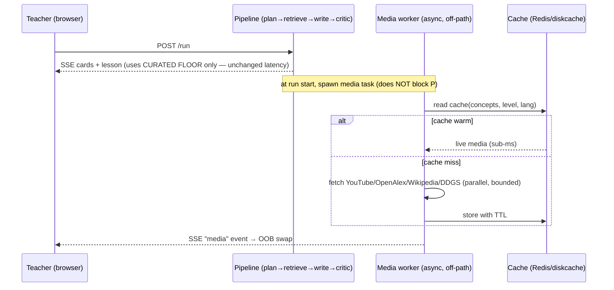

# Dynamic Media Retrieval — Design Plan (for review)

**Date:** 2026-06-06
**Author:** AI Team (LM)
**Status:** ✅ APPROVED — all open questions (§12) resolved 2026-06-06; ready to implement (Phase 0 first)
**Scope:** Make the lesson "Risorse multimediali" (videos, papers, Wikipedia, web) **dynamically retrieved per user query and lesson content**, while **adding zero latency to lesson generation**, staying **backward compatible**, and preserving the **copyright-safe / expert-verified** guarantee.
**Related tickets:** CORE 2 #11b (observability), CORE 4 #15.x (memory), Phase 1/Phase A media work (Angelo).

> This is a **plan only**. No code is changed by this document. It exists so the approach can be reviewed and signed off before implementation.

---

## 1. Executive summary

Today the media shown in a lesson is effectively **static**: videos and scientific articles are read from a pre-built JSON pool keyed by Knowledge-Graph concept, so the same topic yields the same ~5 videos + ~3 articles every run. The live APIs that exist in the codebase (YouTube, OpenAlex, Wikipedia, DuckDuckGo) are either **not wired into the lesson pipeline** (YouTube) or **only fire for out-of-scope queries** (Wikipedia/OpenAlex).

This plan proposes a **"Curated Floor + Decoupled Live Layer"** architecture:

- **Curated floor (unchanged):** the verified pool remains the trusted, instantly-available baseline the Writer uses. Zero network on the critical path.
- **Decoupled live layer (new):** YouTube + OpenAlex + Wikipedia + web are fetched **off the generation critical path**, ranked against the user query *and* the generated lesson content, and streamed into the side panel.
- **Cache-first + background refresh:** live results are served from a warm cache (Redis in prod, diskcache in dev); a scheduled job refreshes popular concepts offline. Cache hits are sub-millisecond.

The result: media becomes genuinely dynamic and query-driven, **without the teacher ever waiting longer for a lesson.**

---

## 2. Current behavior (investigation findings)

### 2.1 Data flow today

```
Planner ── key_concepts ─┐
                         ▼
Retriever ── KG search ── retrieved concept names
   │
   ├─ _fetch_curated_media()      → STATIC pool JSON, keyed by concept  (videos + citations)
   ├─ _fetch_web_links()           → DuckDuckGo (live, separate "web" strip; needs duckduckgo-search)
   └─ _fetch_external_resources()  → Wikipedia / OpenAlex / OER — ONLY if plan.needs_external_apis
                         ▼
            curated_media dict → Writer context + side panel (#media-panel, OOB SSE swap)
```

### 2.2 Why the media is "fixed"

1. **Videos + articles come from a static file.** `MediaLookup` loads `data/media/kg_{domain}_media_pool.json` and returns the pool entries for the retrieved concepts (top-2 per concept, capped at ≤5 videos / ≤3 citations). Reference: `src/aix/agent/media/media_lookup.py` (`get_combined_media`), `src/aix/agent/agents/retriever_agent.py` (`_fetch_curated_media`).
2. **Live YouTube search is not in the pipeline.** `ExternalMediaAPI.search_youtube()` exists but is only invoked by the MCP tool `media.search_youtube` (`src/aix/mcp/tools/media_tools.py`), never by `RetrieverAgent`. So in a lesson run, **no live video search ever happens.**
3. **Live academic/encyclopedic search is gated to out-of-scope.** Wikipedia + OpenAlex run only when `plan.needs_external_apis` is true (`retriever_agent.py`, `_fetch_external_resources`). Normal in-scope topics skip them.
4. **Net effect:** same concepts → same pool entries → same "8 media" (e.g., 5 curated videos + 3 articles) every run.

### 2.3 What already helps us

- The side panel is rendered via an **out-of-band swap of `#media-panel`** carried on the retriever SSE card (`src/aix/webui/lessons/routes.py` module docstring; `_build_retriever_payload` in `src/aix/webui/agent/service.py`). We can push a **second** `#media-panel` swap later without touching anything else.
- There is a **per-process run registry** for in-flight runs and an htmx **lazy-load fragment** pattern (`/lesson/{id}/card-fragment`). We reuse this pattern for media.
- `ExternalMediaAPI` already implements YouTube, OpenAlex, Wikipedia, DDGS, OER with rate-limiting, retries, timeouts, and graceful failure (`src/aix/agent/media/external_apis.py`).

---

## 3. Goals & constraints

| # | Requirement | How this plan satisfies it |
|---|---|---|
| G1 | **Full dynamic layer** (videos + papers + Wikipedia + web) | Live layer queries all four sources, ranked per query+content |
| G2 | **Zero added latency to lesson generation** | Live layer is fully decoupled from planner→retriever→writer→critic; Writer uses curated floor only |
| G3 | **Scalable** | Cache-first + background refresh + bounded concurrency + quota-aware |
| G4 | **Backward compatible** | Feature-flagged (default off), same `curated_media` state key, graceful fallback to today's behavior |
| G5 | **Efficient / cost-controlled** | Caching + quota budgeting + dedup avoid repeated external calls |
| G6 | **Copyright-safe & compliant** | Embeddable-only videos, license tags, "verified" vs "auto-retrieved" trust badges; supports EU AI Act transparency |

---

## 4. The zero-latency principle (most important section)

"Zero added latency" is guaranteed by **separating two latency budgets that today are accidentally merged:**

- **Budget A — Lesson generation latency** (what the teacher waits for): planner → retriever → writer → critic → lesson text. **This must not change.**
- **Budget B — Media panel fill time** (a side panel): can populate progressively *after/around* the lesson without the teacher waiting on it.

We enforce three rules:

1. **The Writer never waits on the live layer.** The Writer's context keeps using the **curated floor** (already in memory, zero network). The retriever node is unchanged on its critical path.
2. **The live layer runs out-of-band.** It is launched as a background task (`asyncio.create_task`) at run start and/or lazy-loaded by the panel via htmx `hx-trigger="load"`. It streams its result into `#media-panel` when ready. It is never `await`-ed inside the generation path.
3. **Cache-first serving + offline pre-warm.** A scheduled refresh job populates a cache for active concepts. At request time the panel reads from the **warm cache** (sub-ms). A cache miss triggers an async fetch that streams in a few seconds later — still off the critical path.



**Bonus enabled by decoupling:** because the live layer runs after the Writer drafts, it can rank media against the **actual lesson content** (not just concepts) at no perceived cost — making results sharper and more query-specific.

---

## 5. Proposed architecture — "Curated Floor + Decoupled Live Layer"

### 5.1 Components of the live layer (full dynamic set)

| Source | Method (already exists) | Notes |
|---|---|---|
| **Videos** | `ExternalMediaAPI.search_youtube()` | Requires `YOUTUBE_API_KEY` (see §9). `videoEmbeddable=true`, `safeSearch=strict`, `relevanceLanguage=it`, `videoDuration` bucket from lesson length. If no key → fall back to curated videos + DDGS video links. |
| **Papers** | `ExternalMediaAPI.search_openalex()` | Run for **in-scope too**, not just out-of-scope. Free, no key, polite-pool. |
| **Encyclopedic** | `ExternalMediaAPI.get_wikipedia_summary()` | Per top concept, Italian first. |
| **Web** | `ExternalMediaAPI.search_web_ddgs()` | Already live; keep relevance + blocklist filtering. |

### 5.2 Query construction (what makes it dynamic)

The live query is built from, in priority order:
1. The **user query** text (the teacher's request),
2. Planner `key_concepts` / `subject_concepts`,
3. **The generated lesson content** (section headings + key terms) — available because the live layer runs after the Writer,
4. Educational-profile filters: language (`it`), level (e.g. "secondaria di secondo grado"), lesson duration → video-length bucket (reuse `_duration_ok` logic).

### 5.3 Merge + semantic re-ranking

1. Collect candidates: curated floor ∪ live results.
2. Deduplicate by URL / YouTube `video_id`.
3. Rank by a blended score:
   `score = w1·semantic_similarity(item, query+content) + w2·quality_signal`
   - **semantic_similarity** reuses the existing embedding stack (`EMBEDDING_MODEL`) — cosine of item text vs query+content embedding.
   - **quality_signal** uses fields we already store: `trusted_channel`, `quality_score`, view count, citation count, recency.
4. Take top-N per bucket (configurable; defaults preserve today's counts).
5. Always retain ≥1–2 curated verified items as a trust floor.

Because ranking is off the critical path, its cost does not affect perceived latency.

### 5.4 Caching & background refresh (scale + cost + zero-latency serving)

- **Cache key:** normalized `(domain, sorted_concepts, level, lang, duration_bucket)`.
- **Backend:** `redis` in prod (already a dependency), `diskcache` in dev (already a dependency). TTL e.g. 7–14 days for videos/papers; shorter for web.
- **Background refresh job:** a scheduled worker (cron / management command) re-fetches live media for the most-used concepts and warms the cache, so request-time is almost always a cache hit. This amortizes YouTube quota and keeps serving instant.
- **Negative caching:** cache empty results briefly to avoid hammering a failing source.

### 5.5 Backward compatibility

- **Feature flag** `AIX_MEDIA_LIVE_ENABLED` (default **false**) → with it off, behavior is byte-identical to today.
- The live layer writes into the **same `curated_media` state key / same panel payload shape** (`_build_retriever_payload`), so templates and the SSE contract are unchanged.
- If any/all live sources fail or are disabled → graceful fallback to the curated pool (the existing `try/except → {}` pattern).

### 5.6 Trust & compliance

- Videos restricted to **embeddable + safeSearch strict**; keep license tags on OER/papers.
- UI distinguishes **"✔ Verificato"** (curated/expert) vs **"Auto-recuperato"** (live) so the trust model stays honest.
- Aligns with the EU AI Act transparency posture in `Internal_Production_Deployment_Plan.md` (Wave 5) — provenance of auto-retrieved media is labeled.

---

## 6. Integration points (concrete)

| Layer | File | Change (high level) |
|---|---|---|
| Live fetch + rank | `src/aix/agent/media/` (new module, e.g. `live_media.py`) | Orchestrate YouTube/OpenAlex/Wikipedia/DDGS + dedup + semantic rank + cache |
| Retriever | `src/aix/agent/agents/retriever_agent.py` | Keep curated floor on critical path; **do not** block on live layer |
| Off-path trigger | `src/aix/webui/agent/service.py` + `src/aix/webui/lessons/routes.py` | Spawn async media task / add `/lesson/{id}/media-fragment` lazy endpoint; emit a `media` SSE event → OOB `#media-panel` |
| Panel template | `src/aix/webui/templates/partials/media_panel.html` | Add progressive "loading…" → fill; verified vs auto-retrieved badge |
| Cache | new helper using `redis` / `diskcache` | Cache-first read; TTL; background warm |
| Background job | `scripts/ops/` (new) | Periodic pool/cache refresh for active concepts |
| Config | `src/aix/core/config.py` + `.env.example` | New flags (see §8) |

No change to the public `/api/v1` contract.

---

## 7. Configuration / env vars (proposed)

```env
# Master switch for the live media layer (default off → today's behavior)
AIX_MEDIA_LIVE_ENABLED=false
# Per-bucket caps (defaults chosen to match today's counts)
AIX_MEDIA_MAX_VIDEOS=5
AIX_MEDIA_MAX_PAPERS=3
AIX_MEDIA_MAX_WEB=6
# Cache TTLs (seconds)
AIX_MEDIA_CACHE_TTL=1209600          # 14 days
# Cache backend (Q3 — resolved). Prod = reuse existing Redis with a versioned
# key namespace; dev = diskcache. Bump the version suffix to invalidate all
# media cache entries at once (e.g. aix:media:v2:).
AIX_MEDIA_CACHE_BACKEND=redis        # dev default: diskcache
AIX_MEDIA_CACHE_NAMESPACE=aix:media:v1
# Background refresh job (Q5 — resolved). Runs as a SEPARATE scheduled process
# on the same VM (cron / systemd timer / media-refresher compose service),
# NOT inside the uvicorn app. Optional: if it never runs, request-time falls
# back to an off-path async fetch (cache miss), so behavior is unaffected.
AIX_MEDIA_REFRESH_ENABLED=false
# YouTube Data API (see §8). Without it, videos fall back to curated + web links.
YOUTUBE_API_KEY=
# Optional: higher academic rate limits
SEMANTIC_SCHOLAR_API_KEY=
```

All read with safe defaults via `os.getenv`, so omitting them preserves current behavior.

---

## 8. YouTube Data API key — how to get it & quota math

**Steps:**
1. Go to **Google Cloud Console** → create (or pick) a project.
2. **APIs & Services → Library →** enable **"YouTube Data API v3"**.
3. **APIs & Services → Credentials → Create credentials → API key.**
4. **Restrict the key:** restrict to "YouTube Data API v3" (API restriction) and, for prod, restrict by server IP. Keep it out of git; store as `YOUTUBE_API_KEY` in `.env` / `.env.prod` (CD secret store).
5. Set `YOUTUBE_API_KEY=...`.

**Quota reality (why caching is mandatory):**
- Default free quota: **10,000 units/day**.
- `search.list` costs **100 units** per call → ~**100 searches/day** if uncached.
- With our cache + background refresh, a search is performed once per concept-set per TTL window, not per lesson run — so a small pilot stays well under quota. Heavy usage can request a quota increase from Google.

**Without a key:** the system still works — videos fall back to the curated pool plus DuckDuckGo video links; papers/Wikipedia/web remain fully live (no key needed for those).

---

## 9. Rollout phases

1. **Phase 0 — Cache + flag scaffolding.** ✅ **DONE (2026-06-06).** `MediaConfig` (env flags, default off) + `MediaCache` (Redis/diskcache/null, versioned namespace, fail-safe) in `src/aix/agent/media/`. `redis`/`diskcache` added to `requirements.txt` (optional at runtime). No behavior change.
2. **Phase 1 — Live papers + Wikipedia for in-scope**, off-path, cached. ✅ **DONE (2026-06-06).**
   - **1 (engine):** `LiveMediaService` + `fetch_live_subject_resources()` in `live_media.py` — OpenAlex + Wikipedia, flag-gated, cache-first, bounded (12s, ≤3 concepts), fail-safe; returns the retriever's `external_resources` shape.
   - **1b (UI wiring, Option A — htmx lazy-load):** `to_panel_media()` adapter; `GET /webui/lesson/{id}/media-live` endpoint; self-loading `#media-live-slot` in `media_panel.html`; `media_live_sections.html` partial. Off the critical path. Byte-identical panel when the flag is off.
   - **1c (UX consolidation, 2026-06-06):** two refinements after review:
     - **Run-context only:** live media is gated to the **SSE retriever swap** (during an active run), `media_live_ready=False` on a plain page open/reload. This mirrors the curated panel (empty on reload, fills during a run) and fixes live media appearing when simply re-opening a previously-completed lesson that still carries a persisted `teacher_query`.
     - **Merged sections:** the live fragment no longer renders its own sections. It emits htmx **OOB swaps** that drop items into the SAME panel sections — dynamic articles append under the single **"Articoli scientifici"** (`#media-citations-live`); Wikipedia fills a single **"Enciclopedia"** section (`#media-live-extra`). Live items carry a per-item `auto` badge (provenance).
3. **Phase 2 — Live videos** via YouTube key, embeddable+safe, cached, with curated fallback. ✅ **DONE (2026-06-06).**
   - **Engine:** `LiveMediaService._fetch()` now fetches YouTube **in parallel** with OpenAlex+Wikipedia per concept (≤`max_videos`), deduped by `video_id`, globally capped, fail-safe. Gated on a real key — without `YOUTUBE_API_KEY` the call is skipped entirely (no fake search-link items; curated pool stays the video floor). The cache key now includes the video cap so the Phase 1 → Phase 2 transition forces a fresh miss (never a stale papers-only entry).
   - **Safety:** `search_youtube` API call hardened with `safeSearch=strict` (already `videoEmbeddable=true`, `relevanceLanguage`).
   - **Mapping:** `to_panel_media()` maps live `videos` → the panel `videos` bucket (`duration`→`duration_hint`, `source:"live"`).
   - **UI merge:** `/media-live` passes `videos`; `media_live_sections.html` emits a 3rd OOB swap into `#media-videos-live`, appending dynamic videos (badged `auto`) under the single **"Video"** section (renamed from "Video curati", mirroring the "Articoli scientifici" merge). Off the critical path; byte-identical when the flag is off.
   - **Fallback:** no key / quota exhausted / API error → curated videos remain (existing `try/except`).
4. **Phase 3 — Semantic re-ranking** against query + lesson content. ✅ **DONE (2026-06-06).**
   - **Scope:** Option A implemented — only the **live/auto-retrieved** items are re-ranked. The curated verified floor remains untouched and keeps its current order/counts, preserving backward compatibility and the trust baseline.
   - **Engine:** `media_ranker.py` ranks the broad live candidate pool against the teacher query + a bounded slice of `lesson_plan_md` using the existing `SemanticEmbedder` (`text-embedding-3-small`) and cosine similarity. Papers also get a small quality prior from citation count + recency; videos/Wikipedia remain semantic-only in this phase (no extra YouTube statistics call/quota).
   - **Cache model:** external API fetches stay cached by concept-set; semantic re-ranking runs **after** cache read, so the same cached candidates can be ordered differently per query/lesson without extra YouTube/OpenAlex/Wikipedia calls.
   - **Counts:** result caps are unchanged (`AIX_MEDIA_MAX_PAPERS=3`, `AIX_MEDIA_MAX_VIDEOS=5` by default). Ranking changes which live items survive the cap and their order, not panel density.
   - **Flags:** `AIX_MEDIA_RERANK_ENABLED=false` by default in `.env.example`; local `.env` enables it for testing. Any embedder/ranking failure falls back to Phase 1/2 fetch order.
4. **Phase 3.1 — Query/quality cleanup for sharper alignment.** ✅ **DONE (2026-06-06).** Improves *what* we fetch and *how* we rank — no new network on the critical path, fully flag-compatible.
   - **Sharper fetch concepts (`_live_media_concepts`):** reprioritized to the most *specific* signals because each concept is a quota-bearing live search — (1) `specific_topic` (**argomento**, e.g. "adhd"), (2) the teacher query stripped of "crea una lezione su …" instruction noise, (3) `subject_area` (**materia**) **demoted to a fallback** added only when fewer than 2 specific concepts exist (broad terms like "Scienze" waste a search and dilute relevance).
   - **Query cleaning (`_clean_lesson_query`):** a conservative, length-guarded regex strips leading instruction phrases ("crea / prepara / spiega … una lezione su/di/sull' …") so we search the topic, not the imperative. Falls back to the original text when nothing matches.
   - **Richer ranking query (`_live_media_ranking_query`):** the reranker's *query side* is built from structured profile signals — `argomento · cleaned query · materia · grade` — at **zero quota cost** (embedding only), so ranking favors on-topic, age-appropriate items even though the broad `materia`/grade are kept out of the fetch.
   - **Videos rank on real text:** the YouTube snippet `description` is now threaded into the live video dict; `media_ranker` embeds video `title + description + channel` (was title + channel), so video ordering reflects actual content, not a terse title.
   - **Latency/compat:** all of the above runs inside the off-path `/media-live` worker (reranker was already off-path); the curated floor and flag-off behavior are unchanged.
5. **Phase 4 — Background refresh job** + observability (Langfuse counters: cache hit-rate, source latencies, item counts). ⏸️ **DEFERRED (2026-06-06).** Split for later: (4a) observability is cheap — the live service already records cache hit/miss + per-bucket counts in `_meta`; a v1 only needs structured per-run logging (no metrics-backend wired yet — Langfuse here is prompt-management only). (4b) background refresh is a SEPARATE scheduled process (`scripts/ops/`), but needs an "active concepts" source (no usage tracking today; could derive from recent `Lesson` rows) and only pays off at scale, so it's not worth it at pilot scale. Neither blocks correctness — a cache miss already falls back to an off-path fetch.
6. **Phase 5 — Trust badges + compliance labeling** in the panel. ✅ **DONE (2026-06-06).**
   - **Explicit trust model:** curated items now carry a green **"✓ Verificato"** badge (expert-reviewed pool); live items keep the amber **"auto"** badge. Previously "verified" was only implied by the absence of a badge — now both provenances are labeled.
   - **Per-item vs section-level rule:** mixed sections (**Video**, **Articoli scientifici** — curated + live interleaved) badge **per item**; curated-only items (OER resources + textbooks) badge per item too; fully-live sections badge once in the header — **Ricerca web** gained an "auto" header badge (Enciclopedia already had one).
   - **Provenance legend + AI transparency:** a panel-bottom legend explains both badges; the "auto" line states the content is **AI-selected and to be verified before didactic use** (EU AI Act transparency, per §5.6 / `Internal_Production_Deployment_Plan.md` Wave 5). The subtitle also reflects "verified + live" wording when the live layer is on.
   - **Scope/cost:** template + CSS only (`media_panel.html`, `.aix-media-provenance` in `aix-brand.css`); no new deps, no network, zero latency impact, and byte-identical when there's no media.

Each phase is independently shippable and flag-gated.

---

## 9a. Deferred UI polish (cosmetic, non-blocking) — ✅ DONE (2026-06-06)

These were known, low-risk presentation issues surfaced during the Phase 1c review.
They did **not** affect correctness, latency, provenance, or the flag-off behavior.
All four are now implemented (template/CSS-only, no critical-path impact).

| # | Item | Original state | Implemented fix |
|---|---|---|---|
| C1 | **Section count excluded live items** | "Articoli scientifici" / "Video" headers showed `{{ … \| length }}` = curated only, even when dynamic items were appended below. | Curated lists got stable IDs (`#media-videos-curated`, `#media-citations-curated`); count pills got IDs (`#media-count-videos`, `#media-count-citations`). A small, idempotent script at the end of the live fragment recomputes each pill from the live DOM after the OOB swaps settle. |
| C2 | **Top "Risorse multimediali" total excluded live items** | The header total counted only `curated_media` buckets; live papers/Wikipedia/videos loaded afterward didn't bump it. | Same script recomputes `#media-total` = videos + citations + OER + web + live Wikipedia (`#media-live-extra`), reading absolute DOM counts (idempotent on re-swap). |
| C3 | **Spacing between curated and dynamic items** | Curated `<ul>` and the live `<ul>` sat back-to-back with no separator ("cramped"). | CSS-only divider: `.aix-media-list:has(li) + .aix-media-live-group:has(li)` adds a subtle dashed top border + margin, shown **only** when both the curated and live lists have items (no orphan border on live-only sections). **No text label** — the per-item `auto` badge already conveys provenance (decision: avoid clutter). |
| C4 | **Inconsistent link affordance** | Live (auto) articles were clickable **title** links; curated articles exposed only a **DOI** link. | **Decision (per review): align live → curated**, not the reverse. Live articles now render the title as plain text with the DOI as the only link (matching curated exactly). Safety nuance: when a live item lacks a DOI it falls back to a single "Apri la fonte" link using its `url`, keeping the same one-link-below-the-title layout. Curated markup unchanged. |

Confined to `media_panel.html`, `media_live_sections.html`, and a CSS rule in
`aix-brand.css`. The count script ships inside the live fragment, so it only runs
when the live layer is active (flag-off panels are byte-identical).

---

## 10. Risks & mitigations

| Risk | Mitigation |
|---|---|
| External API latency/outage | Off critical path + timeouts + cache + graceful fallback to curated |
| YouTube quota exhaustion | Cache-first + background refresh + per-day budget guard |
| Lower-quality auto-retrieved items | Semantic rank + quality signals + curated floor + "auto-retrieved" badge |
| Copyright/safety | Embeddable-only + safeSearch strict + license tags + curated remains default |
| Cost creep | Caps per bucket + caching + flags |

---

## 11. Acceptance criteria (for the future implementation)

- [ ] With `AIX_MEDIA_LIVE_ENABLED=false`, behavior is identical to today (regression-safe).
- [ ] With it on, two different queries on the same domain produce **different, relevant** media sets.
- [ ] **Lesson generation latency is unchanged** vs baseline (measured P50/P95) — live layer never on the critical path.
- [ ] Media panel populates progressively; warm-cache fill is sub-second.
- [ ] All four sources represented when available; graceful fallback when not.
- [ ] Curated verified items always present as a floor; live items badged distinctly.
- [ ] Cache hit-rate, per-source latency, and item counts visible in Langfuse.

---

## 12. Open questions for review — ✅ RESOLVED (2026-06-06)

1. **Latency model → Option B (async panel enrichment). ✅ Resolved.** Live media is fetched off the critical path and streamed into the side panel; the Writer never waits on it. No inline-citation variant (it would re-introduce latency).
2. **YouTube Data API key → Approved & created. ✅ Resolved.** Key obtained and stored in local `.env` as `YOUTUBE_API_KEY`. Fallback (curated pool + DuckDuckGo) confirmed for the no-key / quota-exhausted path.
3. **Prod cache backend → Reuse existing Redis with a versioned key namespace. ✅ Resolved.** No separate Redis server; media keys isolated under `aix:media:v1:` (independently flushable, portable to managed Redis). Dev uses `diskcache`.
4. **Default caps → Keep today's counts, env-configurable. ✅ Resolved.** `AIX_MEDIA_MAX_VIDEOS=5`, `AIX_MEDIA_MAX_PAPERS=3`, `AIX_MEDIA_MAX_WEB=6` (regression-safe; expand later via env, no code change).
5. **Background refresh job → Separate scheduled process on the same VM. ✅ Resolved.** Cron / systemd timer / `media-refresher` compose service, NOT in the uvicorn app and NOT a separate server. Cache-only writes → fully optional and backward compatible.

**Rationale:** none of Q3–Q5 touches the request critical path — cache reads are off-path, smaller caps mean strictly less work, and the refresher runs offline in its own process — so the "zero added latency" guarantee holds. Q4 applies from Phase 1; Q3 and Q5 only matter at Phase 4.

---

## 13. Cross-references

- Current media code: `src/aix/agent/media/` (`media_lookup.py`, `resource_lookup.py`, `external_apis.py`), `src/aix/agent/agents/retriever_agent.py`
- Panel rendering: `src/aix/webui/agent/service.py` (`_build_retriever_payload`, `_count_media`), `src/aix/webui/lessons/routes.py`, `src/aix/webui/templates/partials/media_panel.html`
- MCP live tools (already live): `src/aix/mcp/tools/media_tools.py`
- Deployment / compliance context: `docs/product/Internal_Production_Deployment_Plan.md`

---

## 14. Post-implementation polish & open UI items (handoff)

> Context: Phases 0–5 + §9a are implemented. This section captures (a) two small
> correctness/UX fixes applied in this iteration, and (b) the remaining UI
> refinements left as a clean handoff. **Every option below preserves the plan's
> non-negotiables — zero added lesson-generation latency, efficient, scalable,
> backward compatible (byte-identical when the flag is off).** Options are listed
> best-first within each item.

### 14.1 Fixes applied this iteration ✅

| # | Issue | Root cause | Fix (applied) |
|---|---|---|---|
| F1 | **"Enciclopedia" showed two identical Wikipedia entries** | Wikipedia results were appended per concept with **no dedup** (papers dedup by URL, videos by `video_id`). Synonymous concepts ("adhd" + "disturbi da deficit di attenzione") resolve to the **same canonical page** → duplicate. | Added a `seen_wiki` set in `live_media.py` `_fetch`, keyed on canonical URL (normalized title fallback), mirroring the paper/video dedup. Runs **before** the cache write, so the cached pool is already clean (and the reranker embeds fewer items → marginally cheaper). |
| F2 | **"auto" provenance legend appeared in the empty panel** before any live media existed | The legend's `has_auto` keyed off `media_live_enabled` (the feature flag), so it rendered whenever the flag was on — even at `total == 0`. | In `media_panel.html`, `has_auto` now keys on `media_live_ready or web_links` (actual/imminent live content). The empty placeholder no longer shows the auto legend; flag-off behavior is unchanged (`media_live_ready` is True only during an active run's SSE swap). |

Both are template/engine-local, off the critical path, and backward compatible.

### 14.2 Card ↔ sidebar media-count alignment (open)

**Symptom.** The retriever card shows `8 media` while the right panel header shows `18`.

**Why (by design, not a data bug).** The card's media stat is computed at *retriever time* from the **curated floor only** (`service._build_retriever_payload` → `media_counts`; the card template sums `videos + articles + oer`). The sidebar total is recomputed **client-side** after the off-path live layer streams in (the `recount()` script in `media_live_sections.html`). They measure different things at different moments:

- `8` = what the Retriever Agent pulled from the curated KG pool (an **audit of the retrieval step**).
- `18` = curated + live, after the decoupled `/media-live` enrichment (the **final resource list**).

**Why we deliberately do NOT "just count it in the retriever":** the live fetch (a) happens in a *separate, later* browser request (`/media-live`, `hx-trigger="load"`), (b) ranks against the lesson content that **does not exist yet** at retriever time, and (c) counting it inline would require **blocking on external APIs** — re-adding latency to the critical path. The only layer that sees both counts is the browser, after the lesson is already shown.

**Options (best-first; all zero-latency / efficient / scalable / backward compatible):**

| # | Option | What it does | Trade-off |
|---|---|---|---|
| **1 (recommended)** | **Relabel, don't re-sync** | Keep the card count as curated-only; clarify via the stat label/tooltip (e.g. "media curati dal Knowledge Graph"). Sidebar keeps the merged total. | Pure static text → zero cost. Honors the two distinct meanings (retrieval audit vs final resources). No number ever "changes under the teacher". |
| 2 | **Client-side delta on the card** | Give the card stat value an `id`; extend the existing `recount()` to also update it after the live OOB swaps settle, rendered as `8 (+10)` (curated + auto). | Zero added latency (runs after both land, no new network; reuses the script already shipping). Slightly changes the card's meaning — the `(+N)` framing mitigates this. Reverts to `8` on reload (live not persisted). |
| 3 (not recommended) | **Overwrite the card total** | Replace the card number with the merged `18` via the same client recount. | One matching number, but conflates the retriever's finding with post-hoc live media and is inconsistent on reload (the `card-fragment` re-renders to `8`). |

**Persistence note.** Full alignment *across reloads* needs the P4 media-persistence work (the live enrichment isn't stored on the `Lesson` row today; on reload only curated counts survive). Until then any client-side combined number is per-session.

### 14.3 Trust badges & EU AI Act disclosure (open)

**Current.** `✓ Verificato` (green) for curated/expert-reviewed items; `auto` (amber) for live/auto-retrieved items.

**Concern (raised in review).** Because the *lesson* is AI-generated and even curated resources are **AI-selected** for it, an EU AI Act (Art. 50) transparency disclosure applies to the **whole output** — not only to the live items. So a green `Verificato` badge can *over-claim* (read as "human-certified, no need to check"), while the bare `auto` label names the *mechanism* rather than the *teacher action*. In other words: the per-item trust verdict and the legal disclosure are being conflated.

**Design principle (recommended): decouple the two concerns.**

1. **Per-item badge = provenance only** — a factual statement of where the item came from (curated pool vs live/IA).
2. **One unconditional AI-transparency disclosure** at panel/lesson level that covers *everything* (satisfies Art. 50 for the AI-assembled output regardless of per-item provenance).

This dissolves the "is `Verificato` honest?" debate: the disclosure is always present; the badge just says curated vs IA.

**Wording options (final choice = product + Legal/DPO):**

| Framing | Curated item | Live item | Notes |
|---|---|---|---|
| **Provenance (recommended)** | `Curato` / `Rivisto da esperti` / `Fonte curata` | `IA · tempo reale` / `Auto (IA)` / `Selezionato da IA` | Factual; pairs with an always-on disclosure. No trust over-claim. |
| Verification action | `Verificato` | `Da verificare` | Parallel + simple, but `Verificato` may over-claim under Art. 50 and implies curated needs no checking. |
| Status quo | `✓ Verificato` | `auto` | Mixes dimensions (verification vs mechanism); `auto` is jargon-ish for a functional audience. |

Avoid `statico` / `dinamico` for the badge: it is system-internal jargon, and "dinamico" can read as a *positive* (the opposite of the intended caution).

**Recommendation.** Make the AI-transparency disclosure **unconditional** (the provenance legend + bottom footnote already approximate it — show it whenever the panel has content, independent of provenance), and switch the per-item badges to **provenance** wording: `Curato` (expert-reviewed pool) vs `IA` / `Auto` (live, machine-selected). If a single verification verb is preferred instead, consider `Verificato` → `Rivisto` and `auto` → `Da verificare`. Final wording is compliance-adjacent → confirm with Legal/DPO (consistent with the Art. 50 posture in `Risposte_Domande_Product_Team_Agentic_GraphRAG.md` §1.3).

### 14.4 Curated (EN) vs live (IT) language mismatch (note)

Curated media are **English** (the pool is keyed to the English KG concepts and authored from English sources; `MediaLookup` defaults `language="en"`). The live layer **localizes to the query**: Wikipedia (`it.wikipedia.org`) and YouTube (`relevanceLanguage="it"`) return Italian; OpenAlex has **no language filter**, so live papers can still be English (academic norm). The live `language="it"` is currently **hardcoded** in the `/media-live` route. Not a bug — it actually showcases the live layer's localization value — but if the EN curated videos are undesirable for Italian classes, future options are: per-language curated pools, a language-preference filter in the curated lookup, and deriving the live `language` from the lesson/profile instead of hardcoding it.
